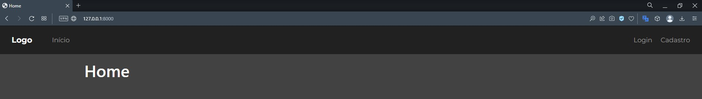
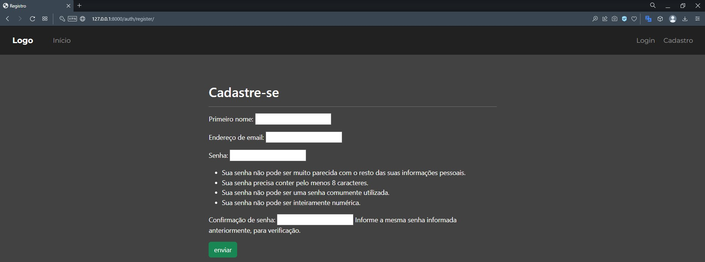
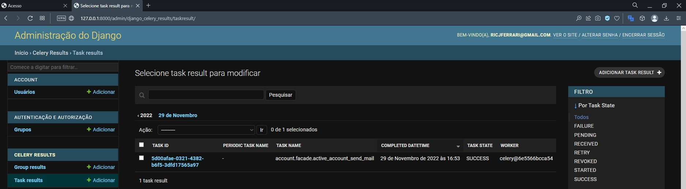
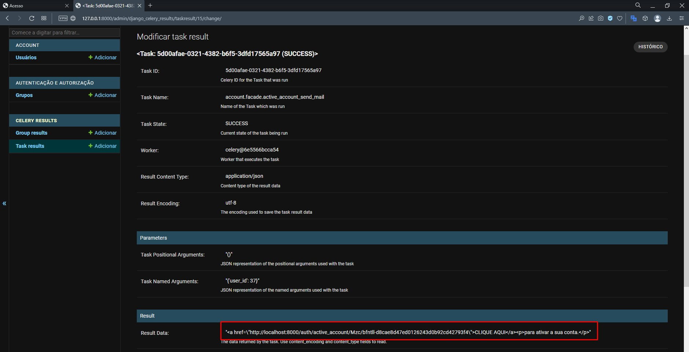
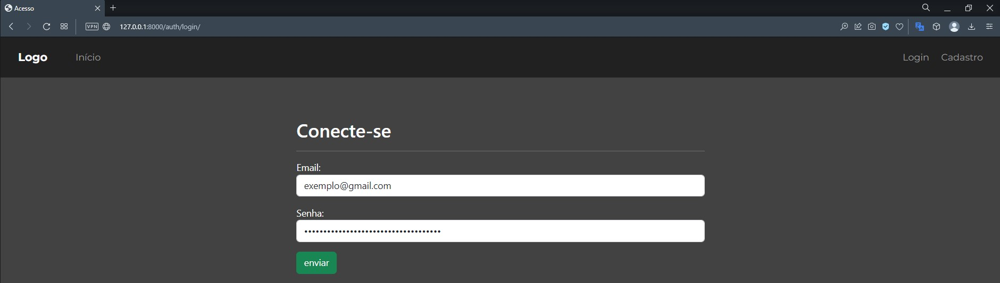
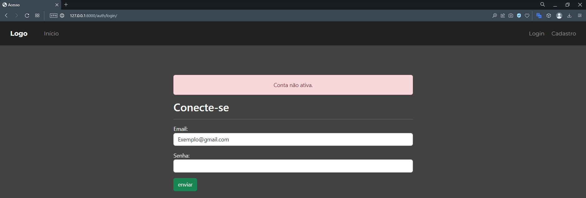
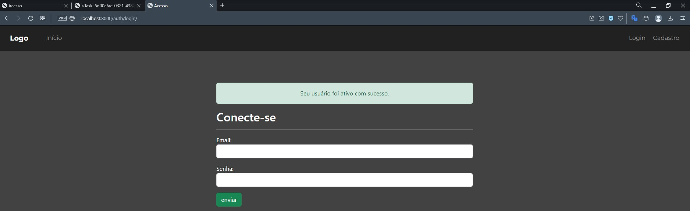
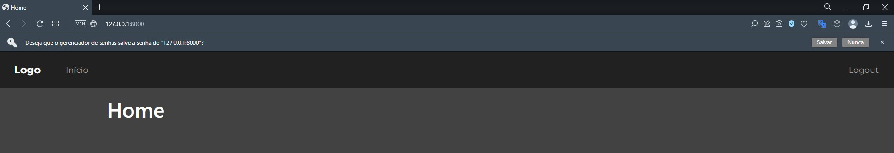

<p align="center">
  <a href="https://www.djangoproject.com" target="blank"></a>
</p>

<p align="center">
  <a href="#-tecnologias">Tecnologias</a>&nbsp;&nbsp;&nbsp;|&nbsp;&nbsp;&nbsp;
  <a href="#-projeto">Projeto</a>&nbsp;&nbsp;&nbsp;|&nbsp;&nbsp;&nbsp;
  <a href="#-como-executar">Como executar</a>
</p>


<hr>

<a id="-tecnologias"></a>

## Tecnologias

Esse projeto foi desenvolvido com a seguinte tecnologia:


<hr>

<a id="-projeto"></a>

## 💻 Projeto

O projeto Django-With-Celery foi desenvolvido como um exemplo de implementação de uma aplicação web com Django e sistema de mensageria. O acesso padrão do Django foi alterado de username para email, aonde a conta recém criada se encontra inativa e um email de ativação é enviado.

<p align="center">
  
</p>

<p align="center">
  
</p>

<p align="center">
  
</p>

<p align="center">
  
</p>

<p align="center">
  
</p>

<p align="center">
  
</p>

<p align="center">
  
</p>

<p align="center">
  
</p>

<a id="-como-executar"></a>

## 🚀 Como executar

### 💻 Pré-requisitos
 **Antes de começar, verifique se você atendeu aos seguintes requisitos:**

- Você tem uma máquina `< Windows / Linux / Mac >`.

- Você instalou a versão mais recente de `< Docker >`


### Como instalar localmente:

- clone ou baixe o repositório.

Com o ambiente virtual ativo:

- Altere o arquivo `env` com as informações que desejar e depois renomeie para `.env`.

## 🚁 Pequena ajuda
O projeto conta com um arquivo Makefile para facilitar os comandos.

## 👨‍💻 Ativando a aplicação
Para executar a aplicação(Com o Docker ativo):

- Acesse a pasta do projeto no terminal e execute:

```console
docker-compose up -d --build -V
```

Após o código finalizar a execução você poderá acessar a aplicação em [localhost:8000](localhost:8000) no seu navegador.

Obs: Para acessar o painel admistrativo da aplicação é necessário criar um superusuário.

- Com a aplicação em execução acesse o terminal e execute:

```console
docker-compose exec app python manage.py createsuperuser
```

Após a criação do superusuário você poderá acessar o painel administrativo da aplicação em [localhost:8000/admin](localhost:8000/admin) no seu navegador.

## 👨‍💻 Parando a aplicação
- Acesse a pasta do projeto no terminal e execute:

```console
docker-compose down
```